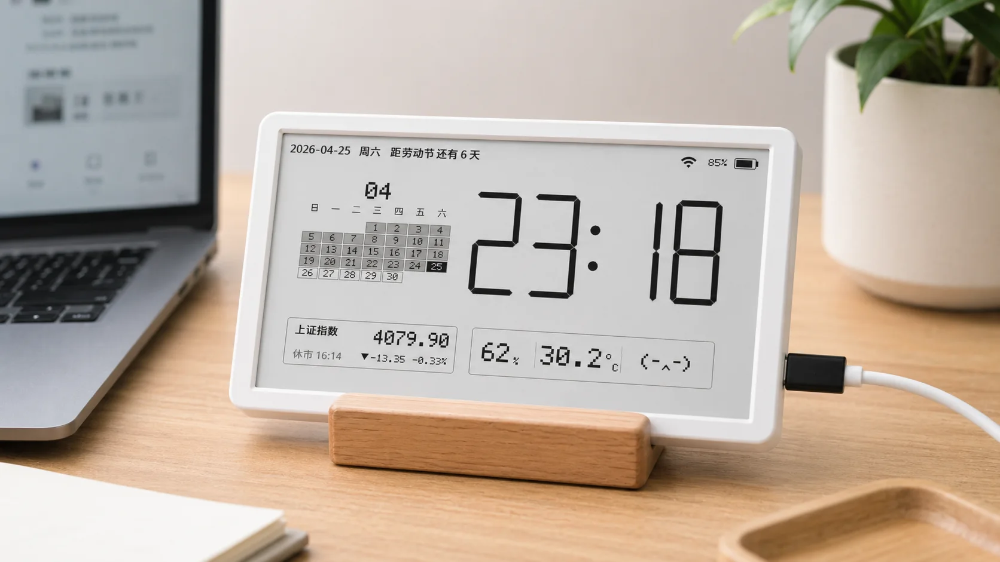
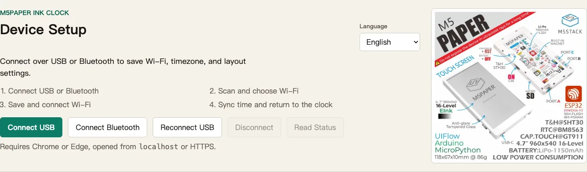
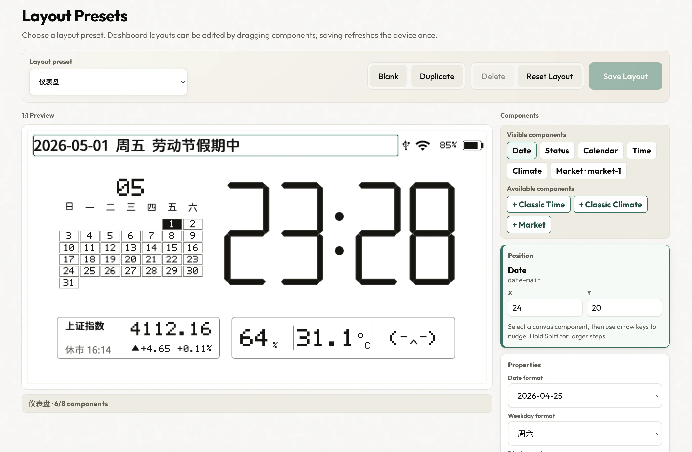

# M5Paper Ink Clock

[中文说明](README.zh-CN.md)

A horizontal e-ink clock for M5Paper-style hardware built with PlatformIO and
the M5EPD Arduino library.



## Features

- Wi-Fi setup flow on first boot
- RTC sync from NTP with configurable timezone
- Auto-connect on boot and auto-enter clock view after successful sync
- Classic segmented clock and editable dashboard layout presets
- Web-based 1:1 layout preview with draggable clock, calendar, market, and
  climate components
- China A-share and index market cards with code/name/pinyin search
- Temperature and humidity from the onboard SHT30 sensor
- Configurable date format, comfort thresholds, and e-ink clarity refresh
  interval
- Internal SPIFFS-backed CJK TTF for UI text and Chinese stock names
- G38 side buttons:
  - left/right: switch saved layout presets
  - center short press: full refresh
  - center long press: enter settings

## Project Layout

- `src/ClockApp.*` - app state, pages, input handling, and rendering
- `src/SegmentRenderer.*` - segmented digit drawing
- `src/ConnectivityService.*` - Wi-Fi and NTP sync
- `src/SettingsStore.*` - persisted settings
- `src/SensorService.*` - SHT30 temperature and humidity access
- `web/*` - static Chrome Web Serial/Bluetooth configuration page
- `include/logic/*` - small UI and segment helpers
- `test/test_logic/test_main.cpp` - native logic tests

## Build

Builds use the checked-in holiday data directly, so day-to-day compilation works
offline without any pre-build network step.

```bash
platformio run -e m5stack-fire
```

The bundled `data/cjk.ttf` font lives on SPIFFS. You can build a complete flash
image that includes bootloader, partitions, firmware, and SPIFFS in one file:

```bash
./tools/build_merged_image.sh
```

This produces:

```text
.pio/build/m5stack-fire/m5-paper-clock-complete.bin
```

## Web Config

After flashing the firmware, you can configure the clock from Chrome over USB or
Bluetooth without entering the on-device settings flow.

The files under `web/` are static assets and can be deployed directly to a
static HTTPS host such as Netlify. HTTPS is required for Web Serial and Web
Bluetooth. For local development, start a server:

Hosted Web Config:

```text
https://m5-paper-clock.netlify.app/
```

```bash
./tools/start_web_config.sh
```

Then open:

```text
http://localhost:4173
```

Use Chrome or Edge. For USB, plug the device in and click `连接 USB` once to
allow the serial port; the page will reconnect to authorized USB devices on
load. For Bluetooth, click `连接蓝牙` and choose `M5Paper Clock`. The page can:

- read device status
- scan nearby Wi-Fi networks
- save SSID and password
- save timezone and e-ink clarity refresh frequency
- create, duplicate, delete, and save layout presets
- add/remove dashboard components and drag them in a 1:1 preview
- configure market symbols, date display, and comfort thresholds per component
- connect Wi-Fi and sync time
- trigger a full refresh or reboot
- run online OTA from GitHub Release metadata
- upload a local OTA `firmware.bin` over USB serial

USB and Bluetooth share the same JSON command protocol. Only lines prefixed with
`@cfg:` are treated as protocol messages, so normal device logs can continue to
print on the USB serial port.

Market search runs in the browser through Eastmoney JSONP, so the static page
does not need a backend service. It supports stock/index code, Chinese name, and
pinyin queries such as `600519`, `茅台`, `上证`, and `GZMT`.

Local OTA upload is USB-only and updates only the app firmware partition, so
Wi-Fi, timezone, market symbol, and other saved settings stay in place. The
device must already be running firmware that supports the local OTA protocol; use
full flashing or firmware-only flashing once if upgrading from an older build.

The Web UI limits saved dashboard presets to five. The classic digital layout is
kept as a built-in preset and can be selected with the device buttons or from the
Web UI.





## Update Holiday Assets

Refresh the embedded holiday table manually when you want newer holiday data:

```bash
node tools/update_holiday_data.mjs 2026 2027
```

## Test

```bash
platformio test -e native
```

## Release Package

Build release artifacts for GitHub Release, web full-flash, and OTA metadata:

```bash
./tools/package_release.sh
```

This writes a versioned directory under `dist/` with:

- `firmware.bin` for OTA app updates
- `m5-paper-clock-complete.bin` for full browser/serial flashing
- `spiffs.bin` for filesystem recovery
- `ota.json` for update checks
- `web-flash-manifest.json` for ESP Web Tools-style full flashing

Set `FIRMWARE_VERSION`, `FIRMWARE_GIT_SHA`, `FIRMWARE_BUILD_TIME`, or
`RELEASE_BASE_URL` to override generated metadata. Pushing a tag like `v1.2.3`
runs the release workflow and uploads these files to GitHub Release.

## Upload

Replace the upload port with the one shown by `platformio device list`.

Two flashing modes are supported:

1. Full image
   Use this for first flash, factory reset, recovery, or when the SPIFFS
   contents changed.

```bash
./tools/flash_all.sh /dev/cu.usbserial-02120D19
```

This builds `m5-paper-clock-complete.bin` and writes it once at `0x0`.

2. Firmware only
   Use this for day-to-day development and to stay aligned with future OTA
   update packages.

```bash
./tools/flash_firmware.sh /dev/cu.usbserial-02120D19
```

This updates only the app image and keeps the existing SPIFFS/font partition in
place.

If you omit the port, both scripts will try to auto-detect a common USB serial
device.

For manual full-image flashing:

```bash
python3 -m esptool \
  --chip esp32 --port /dev/cu.usbserial-02120D19 --baud 1500000 \
  write_flash --flash_mode dio --flash_freq 40m --flash_size 16MB \
  0x0 .pio/build/m5stack-fire/m5-paper-clock-complete.bin
```

For manual firmware-only flashing:

```bash
platformio run -e m5stack-fire -t upload \
  --upload-port /dev/cu.usbserial-02120D19
```
